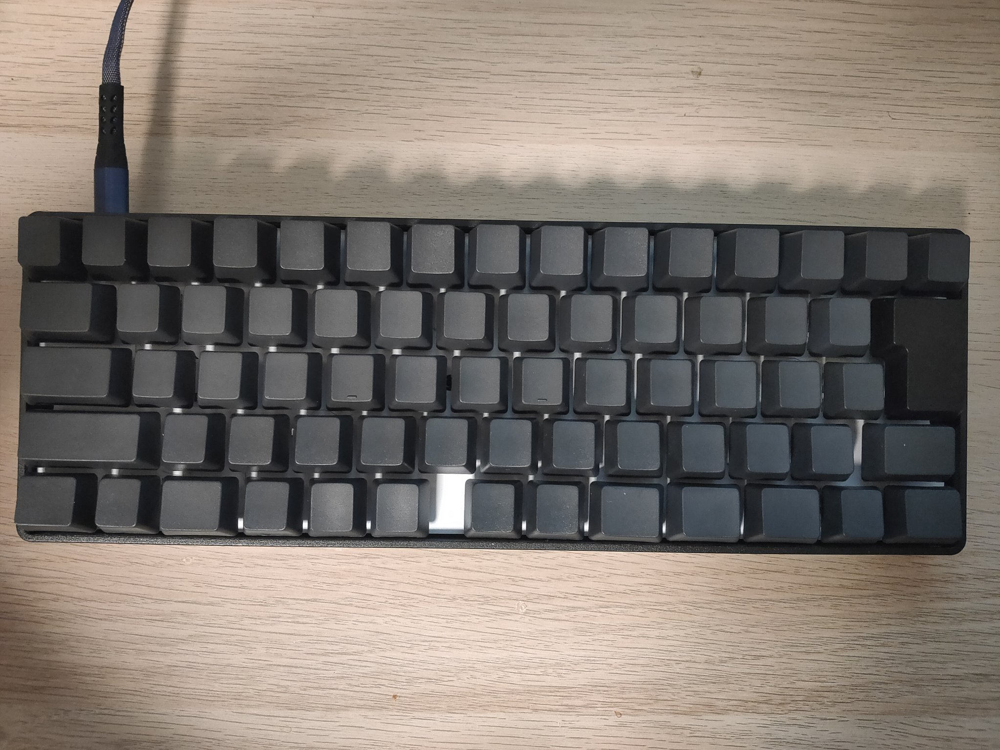

僕は普段からAutoHotKeyやAutoKeyなどを使って色々変なキーマップをして居るんですが，夏休みに何社かインターンに行くことになり，流石にインターン先のPCにその様なものを勝手にインストールするのはどうかなあと思ったので，折角なので前々からやってみたかった自作キーボードに挑戦することにしました(キーボードの持ち込みはOKらしい)．と言っても，キットとスイッチやケースを買ってきて組み立てただけなんですけどね．

[JP60SS - 天高工房](https://www.skyhigh-works.xyz/jp60ss/)

### 自作キーボードに求めるもの

自分が自作キーボード(と言っても，プログラブルであるならば自作でなくてもいいのですが，)に求めるものとして，
* JIS配列であること
* 非分割であること
* 所謂60%サイズであること
があります．JIS配列を15年以上使って居るため最早US配列に矯正するのもダルいですし，非分割のものは持ち運びにはどうも適してない様に見えます．前のアルバイト先にはRealforceを毎回持ち込んで居たのですが，かなり重かったのを覚えて居ます．先日ネットサーフィンをして居たところ，このJP60SSを見つけ，(若干最下段の配列には不満が有るものの)これだ！と思って満を持して作ることにしました．

### キーマップ

キーマップは今も色々試行錯誤中ですが，取敢ずこんな感じにしました．

Layer0とLayer1はほぼデフォルトのままです．CapsLockは今まで1度も使ったことがないのでリストラするのは当然ですが，今までは(特に左側のキーとの同時押しでは)Ctrlとして，Ctrl+IJKLではカーソル移動として使って居たので，Layer3はその様に配置しました．

### 費用

かかった費用は次の通りです．

|品目|価格|
|---|---:|
|JP60SS kit| \13,200 |
|[Kailh BOX Silent x68](https://shop.yushakobo.jp/products/kailh-box-silent-switch)| \5,236 |
|[60% プラスチックケース](https://shop.yushakobo.jp/collections/case-1/products/60-plastic-case)|\3,300|
|[無刻印104 キートップセット](https://shop.yushakobo.jp/collections/keycaps-1/products/a0300bp)|\3,278|
|USB Type-A - Type-Cケーブル 2m|\550|
|合計|\25,564|

買ってから気づいたんですが，これ普通にHHKB Professional2 JP(中古)とAlternativeControllerセットで購入できますね．．．．．．
