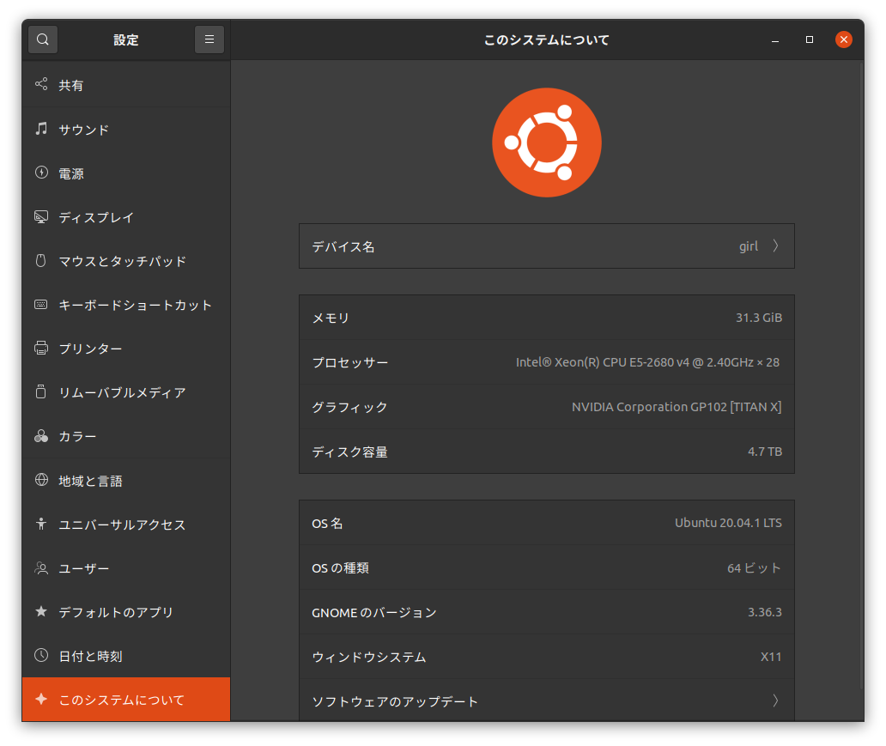
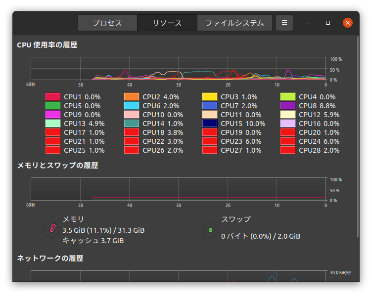

流石に7年も使ったら寿命かなあと思って組み直しました．コスパ無視のロマン最優先の構成です．

| | 旧 | 新 |
| :---: | :---: | :---: |
| CPU | Intel Core i7-4770 | Intel Xeon E5-2680v4 |
| Motherboard | GIGABYTE GA-B85M-D3H Rev1.1 | ASUS STRIX X99 GAMING |
| GPU | Geforce GTX 750Ti | GTX TITAN X (Pascal) |
| RAM | CFD W3U1600HQ x2 (DDR3 1600 Total 16GB) | CORSAIR CMK32GX4M2A2666C16 x2 (DDR4 2666 Total 32GB) |
| PSU | CORSAIR HX650 (650W) | CORSAIR RX1000 (1000W) |

また7年位はこの構成で頑張る所存です．
